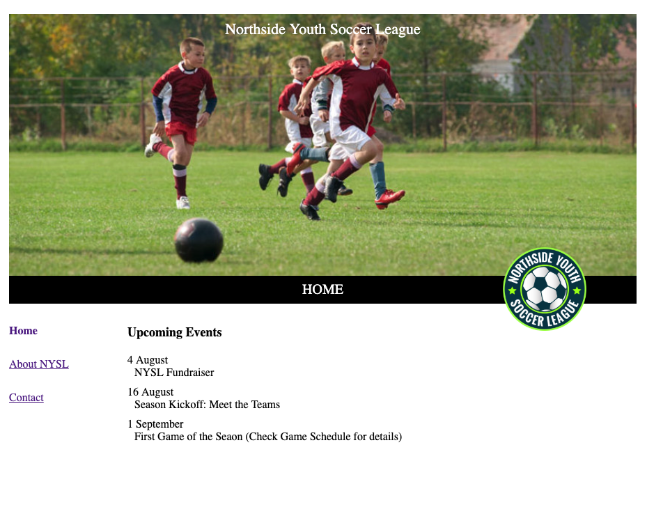
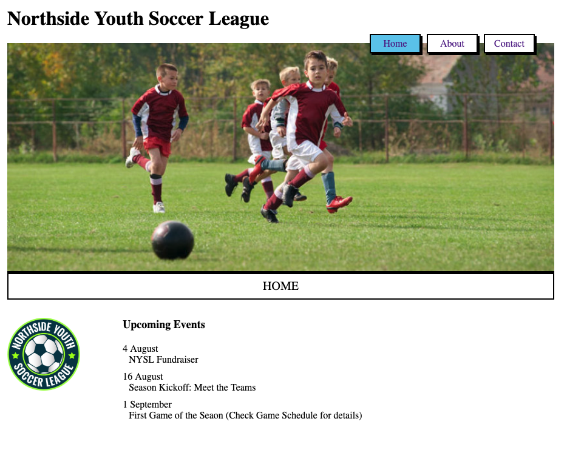
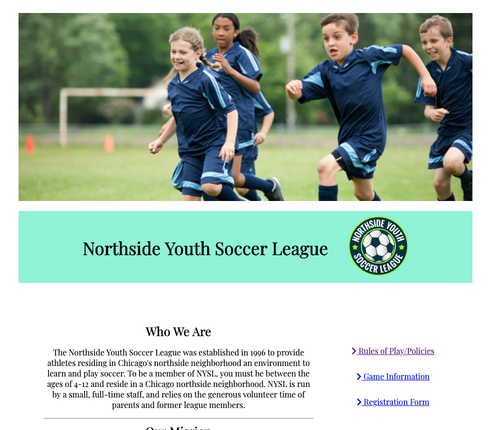
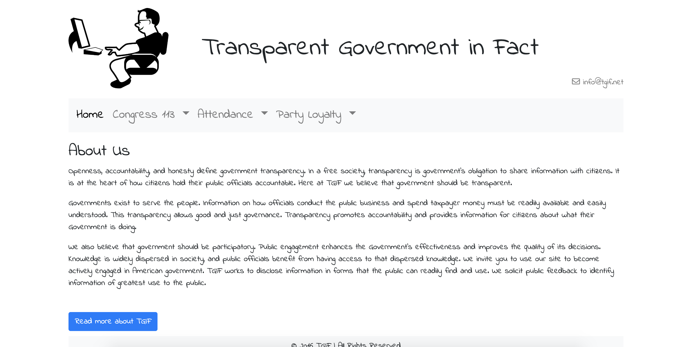
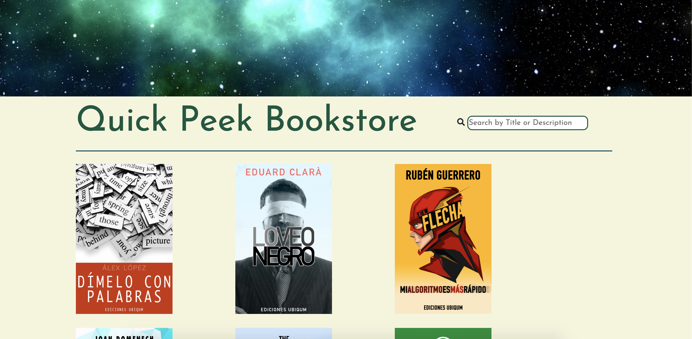
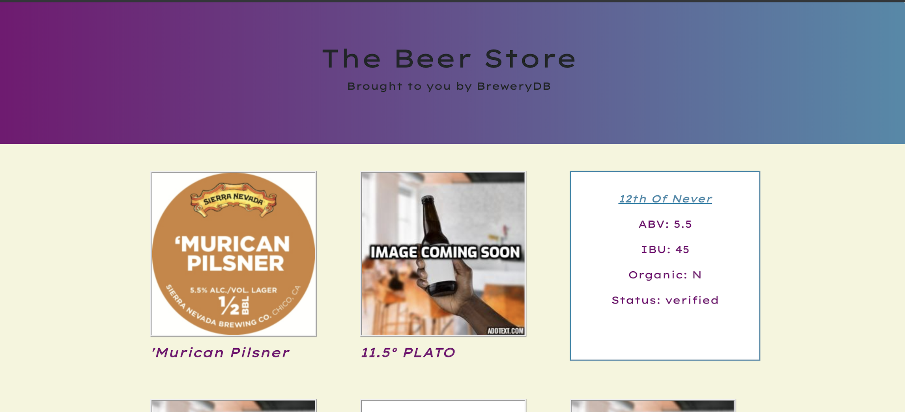

# ubiqum-bootcamp

Projects I have built while attending Ubiqum Bootcamp Berlin:

### Project One:

The very first project involved building the same site "NYSL" three times.
- version one and two are design specs that were given to be implemented.
- version three was left open and I was to create my own "original" design.

This project involved utilizing HTML and CSS skills.

#### Version one:

#### Version two:

#### Version three:

### Project Two:

"TGIF" - Transparent Government In Fact.
The second project involved utilizing HTML, CSS, Javascript and Bootstrap.

#### Final Version:

### Project Three:

"Stress Test". You are given two days to complete an "online bookstore". The focus here is on
fetching and displaying data. This project involved utilizing HTML, CSS, Fancybox, Javascript and Bootstrap.
(Optionally you could also add a search bar feature)

#### Final Version:

### Project Four:

The Beer Store. This project is quite similar to the one before it, the bookstore. I used the same "flip card" idea for
displaying the beers as I did for the books. More importantly the focus here was on making use of [this](https://www.brewerydb.com/developers/docs) REST API, thus forcing me to experiment with pagination and infinite scroll.

#### Final Version:

